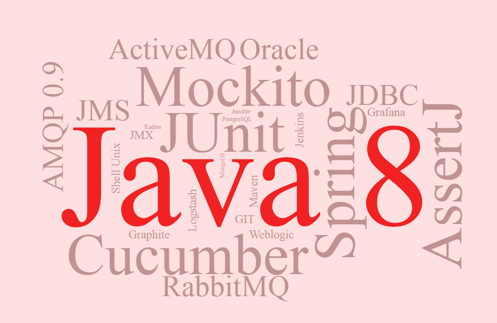

# Loïc Ledoyen - Développeur Java

Au cours de mes missions, j'ai été amené à bootstraper de nouveaux projets et à mettre en place l’outillage permettant de conserver ou de retrouver la maitrise du code.

Oscillant entre le développement et l’architecture logicielle, je considère que la veille technologique fait partie de mon métier et fait profiter des meilleures solutions aux projets de mes clients.

## Compétences

* Java 5 à 8, Scala
* Maven 3, Jenkins, Sonar
* Spring (+ mvc, data-jpa, orm, batch, integration, boot)
* Junit 4, PowerMock (mockito & easymock), H2
* Logstash, [JmxTrans](https://github.com/jmxtrans/jmxtrans), [Graphite](https://github.com/graphite-project/), [Grafana](https://github.com/grafana/grafana)
* CXF, Gson, Jackson, [JsonPath](https://github.com/jayway/JsonPath), XStream, Jaxb, Xpath
* Hibernate (hbm & JPA)
* EJB, MDB, JMS, JSP, JSTL
* Oracle, SQL, PL-SQL
* Weblogic 9 / 12, Tomcat 7, Jetty 8
* HTML, CSS, JS, Jquery, Bootstrap, AngularJS
* Design patterns (chaîne de responsabilité, visitor, wrapper, façade, singleton, etc.)
* Scrum, XP

## Expériences

### Aout 2014 – maintenant
> ENEDIS (ex ERDF) (Linky et CCMA), équipe de 25 personnes, Paris

* Développement d’un outil orienté plugin pour le test du système (15 JVM, 3 bases Oracle, middleware JMS, OMA-DS).
  * Développement de connecteurs (OMA-DS, JMS, SSH, JDBC, JMX)
  * Création d’un formalisme XML pour testeurs fonctionnels “non-codeurs”
  * Génération automatique de la documentation des tests
* Architecture et développement en Java 8 d'un projet initialement codé en C++ destiné à recevoir des centaines de milliers de connexions OMA-DS
  * Cadrage technique et accompagnement (Java 8 / OMA-DS)
  * Mise en place des bonnes-pratiques avec l’équipe
  * Développement d’une structure pour les tests “sans IO”
  * Mise en place d’indicateurs JMX (Metrics + dynamicMXBean) pour le monitoring
* Architecture et développement d’un projet traçant toutes les connexions avec le système, respectant les critères : fiabilité et haute disponibilité)
  * Logstash, RabbitMQ, spring-integration
* Mise en place de la supervision (monitoring et troubleshooting)
  * [JmxTrans](https://github.com/jmxtrans/jmxtrans), [Graphite](https://github.com/graphite-project/), [Grafana](https://github.com/grafana/grafana), [Seyren](https://github.com/scobal/seyren)
  * Jdbc, aggrégation, mail / Graphite (plaintext protocol)

### Février 2014 – Juillet 2014
> Life & Company (CRM Company Group), équipe de 10 personnes, Paris

Consultant sur un projet de CRM dans le domaine de la santé, développement et architecture de la partie back.

* Mise en place de tests unitaires et tests fonctionnels (SoapUI scripts, Arquillian, glassfish-embedded, H2, PowerMock)
* Amélioration du mécanisme d’injection de propriétés par CDI dans un serveur JBoss (basé sur la publication de Piotr Nowicki)
* Amélioration du processus de release (maven-release-plugin)
* Améliorations des performances de l’application (analyse des métriques newRelic)
* Développement de nouveaux modules applicatifs

### Janvier 2014
> Création de l'entreprise LEDOYEN EI

### Juin 2011 – Décembre 2013
> BNP Paribas arbitrage (via So@t), équipe de 15 personnes, Paris

Projet Finance Front international, workflow gérant le cycle de vie des deals et proposant une interface appropriée aux différents acteurs (Sales, Traders, Middle, BO), support régulier auprès des utilisateurs (worldwide).

* Migrations techniques (Maven1→ M2, weblogic 9 → 12, java 5 → 7)
* Amélioration de l’organisation du projet (packaging de 25 projets)
* Améliorations des performances de l’application
* Réduction de la consommation mémoire
* Développement d’outils pour réduire le nombre de lignes de code du projet
* Mise en place de l’usine de build (jenkins, sonar, nexus)
* Création d’un projet front d’agrégation de données back
* Développement de nouveaux composants applicatifs
* POCs de nouvelles architectures

### Janvier 2010 – Juin 2011
> SFR (via OnePoint), équipe de 2 à 10 personnes, Paris

Projet interne utilisé par les équipes service client afin de traiter l’ensemble des demandes (courier, téléphone, mail, fax).
Création du socle technique pour le service d’infoconso.

* Migrations techniques (Maven1→ M2, suppression de code mort)
* Responsable développement du portail interne contact client
* Refonte du portail en Wicket
* Création d’un projet frontal d’agrégation de web-services à direction des smartphones et du selfcare
* Mise en place de monitoring applicatif (AOP)

## Cursus

### Functional Programming Principles in Scala (coursera) (2013)
* Rudiments de programmation fonctionnelle
* API Scala de base
* Réflexion sur des problèmes complexe

### Ingénieur INPG-ENSERG (PHELMA depuis 2009)
* Informatique (programmation C & Java)
* Interface homme-machine
* Management et qualité

## Langues
* Français : langue maternelle
* Anglais : courant (TOEIC 2009 : 770), pratique professionnelle entre 2012 et 2014

## Publications
* [Spring 3.1 : Utiliser l’abstraction de cache](http://blog.soat.fr/2012/05/spring-3-1-utiliser-labstraction-de-cache/)
* [Spring 3.1 : Utiliser l’abstraction de cache – 2 “le retour”  ](http://blog.soat.fr/2012/08/spring-3-1-utiliser-labstraction-de-cache-2-le-retour/)

